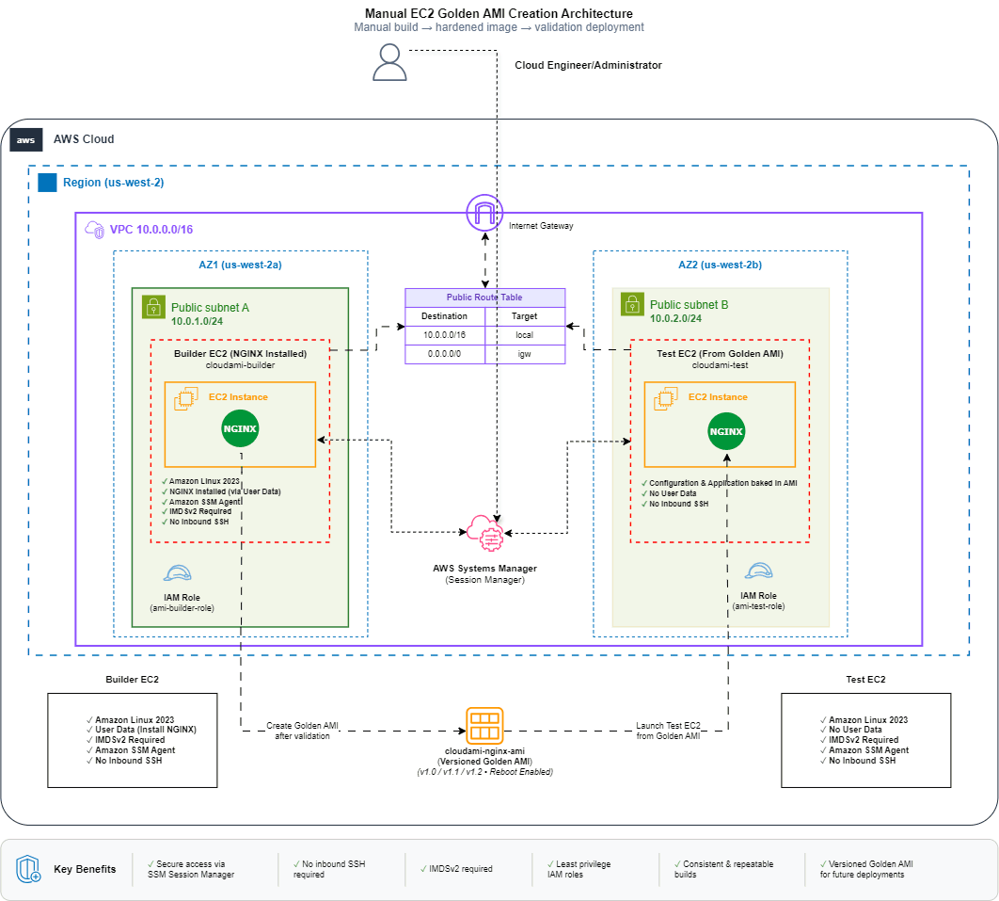
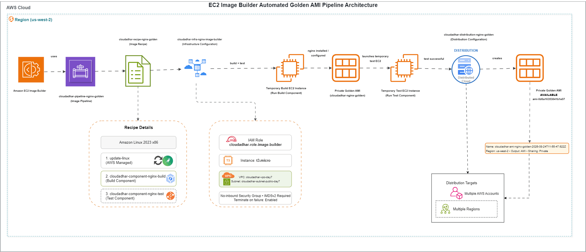
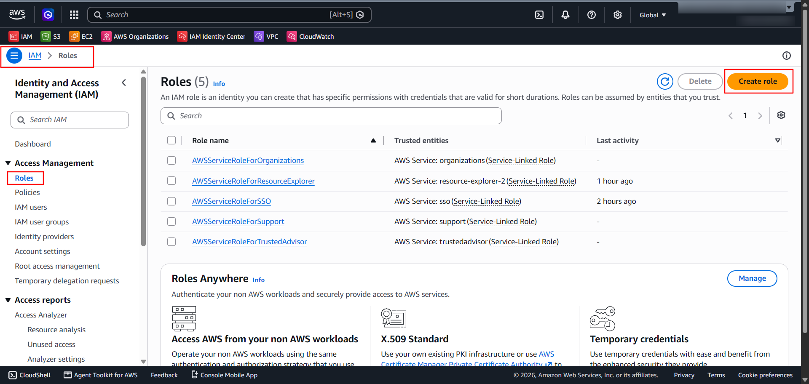
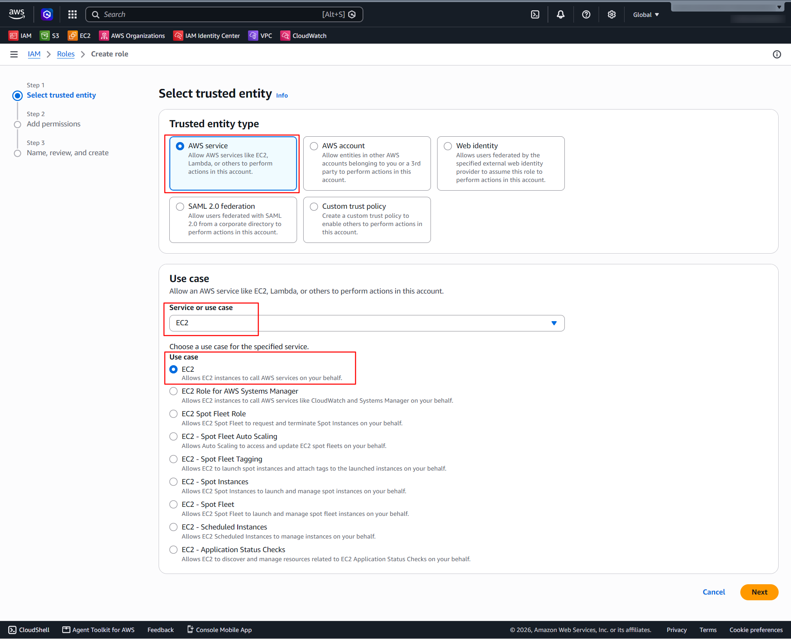
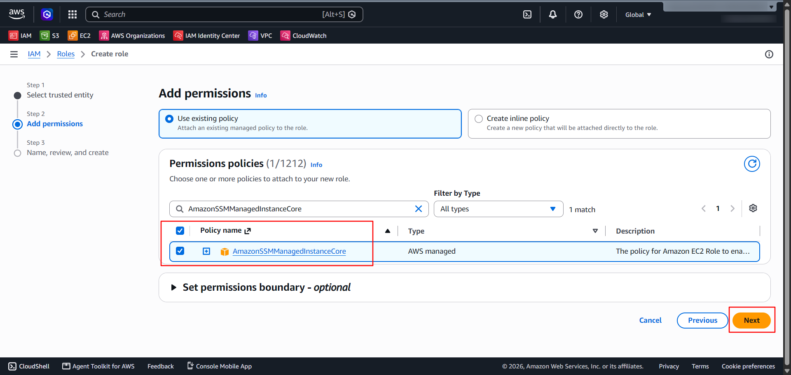
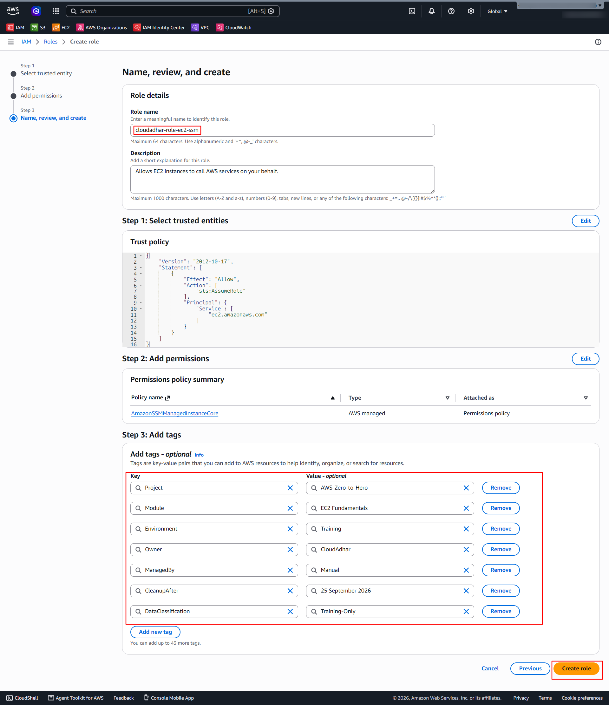
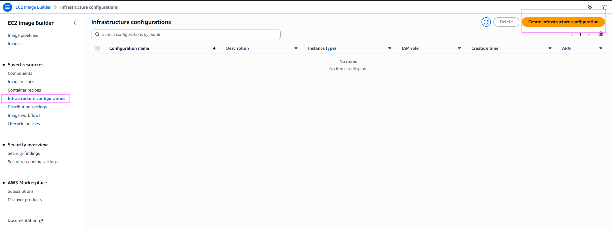
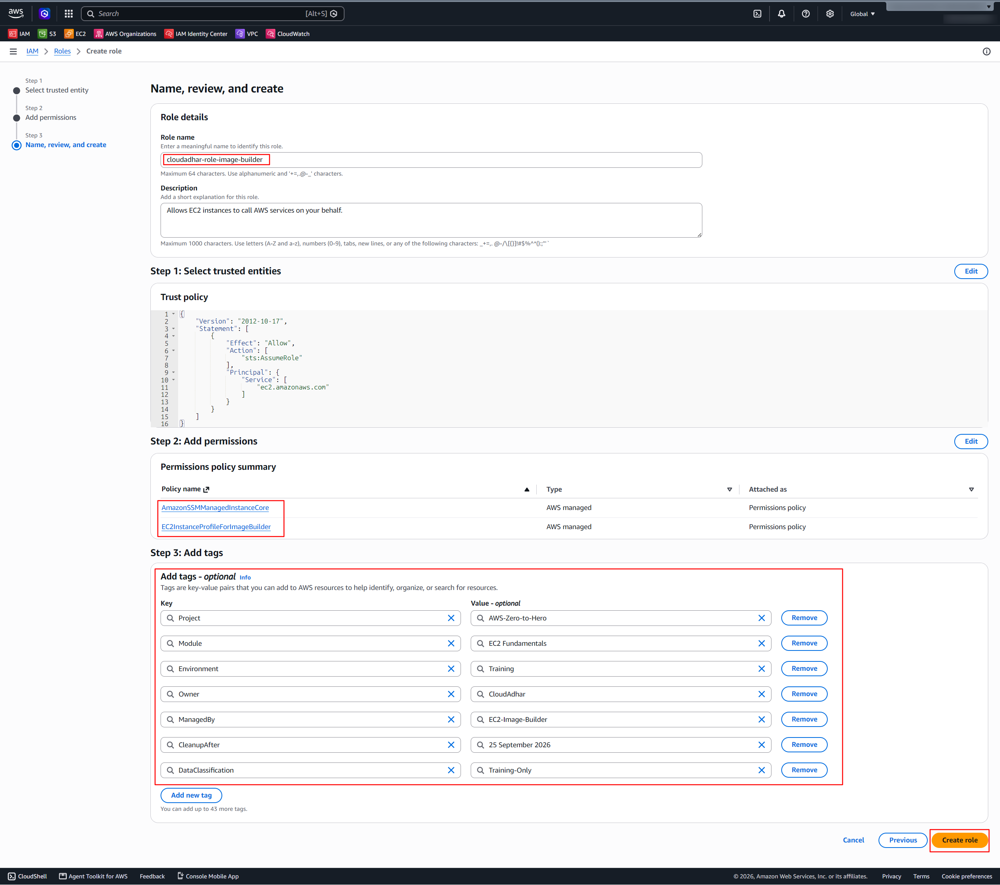
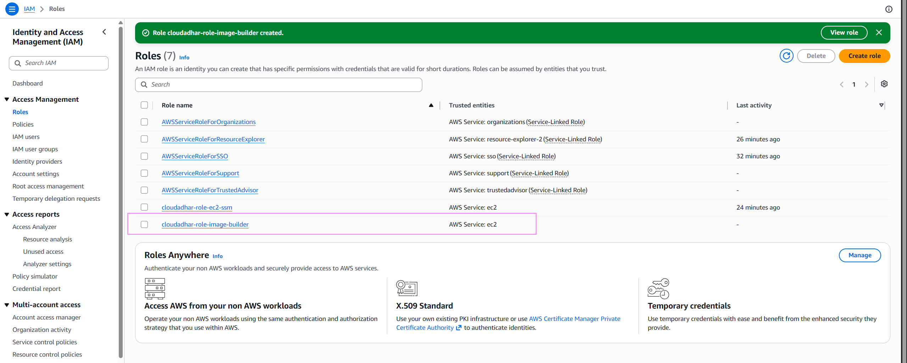

# Week 4 - Day 7: Secure NGINX Golden AMI – Manual Build & EC2 Image Builder Automation

## Name

Malathi Shetty

---

## Tasks Completed

- [x] Watched/read the weekly content
- [x] Completed hands-on labs
- [x] Added screenshots/proof
- [x] Created architecture diagrams
- [x] Posted on LinkedIn
- [x] Cleaned up AWS resources

---

# Objective

The objective of Day 7 was to understand EC2 fundamentals and build a secure, repeatable NGINX Golden AMI.

The lab covered:

- EC2 instance configuration
- VPC, subnet, route table and Internet Gateway
- Security Groups
- IAM instance roles
- User Data bootstrapping
- AWS Systems Manager Session Manager
- IMDSv2 enforcement and validation
- Manual Golden AMI creation
- Golden AMI versioning
- EC2 Image Builder
- Image Builder components
- Image recipes
- Infrastructure configuration
- Distribution configuration
- Automated image pipeline
- Image build and test validation

---

# Architecture

## 1. Manual EC2 Golden AMI Creation Architecture



### Architecture Overview

The manual workflow starts with a Builder EC2 instance running Amazon Linux 2023.

The Builder EC2 instance:

- Uses User Data to bootstrap NGINX.
- Uses an IAM instance role for AWS Systems Manager.
- Uses Session Manager for secure administration.
- Requires IMDSv2.
- Is validated before creating the Golden AMI.
- Is patched before creating the final Golden AMI.

The Golden AMI is then used to launch a Test EC2 instance.

The Test EC2 instance is launched **without User Data** to verify that NGINX and the required configuration are already baked into the AMI.

### Manual AMI Lifecycle

```text
User Data
    |
    | bootstraps
    v
Builder EC2
    |
    | validate + patch
    |
    | creates image
    v
Golden AMI v2
    |
    | launches from
    v
Test EC2
    |
    v
NGINX validation successful
```

---

## 2. EC2 Image Builder Automated Golden AMI Pipeline



### Architecture Overview

EC2 Image Builder was used to automate the Golden AMI creation process.

The pipeline uses:

```text
Image Pipeline
      |
      +--> Image Recipe
      |
      +--> Infrastructure Configuration
      |
      +--> Distribution Configuration
```

The Image Recipe defines:

* Amazon Linux 2023 as the base image
* AWS-managed `update-linux` component
* `cloudadhar-component-nginx-build`
* `cloudadhar-component-nginx-test`

The Image Builder infrastructure configuration defines the temporary build environment, including the EC2 instance type, IAM role, networking, security group, and IMDSv2 requirement.

The Distribution Configuration defines the target Region and output AMI configuration.

The pipeline successfully completed and produced an **Available AMI**.

---

# Decision Table

| Requirement                          | Choice                              | Reason                                                                                                              |
| ------------------------------------ | ----------------------------------- | ------------------------------------------------------------------------------------------------------------------- |
| Repeatable patched NGINX baseline    | Golden AMI                          | Provides a standardized and reusable image containing the required OS, patches, and application configuration.      |
| Automated image creation and testing | EC2 Image Builder                   | Automates repeatable image building, testing, versioning, and distribution.                                         |
| Secure instance administration       | AWS Systems Manager Session Manager | Provides secure instance administration without requiring inbound SSH access or SSH keys.                           |
| Token-based metadata                 | IMDSv2 Required                     | Requires a session token before metadata can be accessed, providing stronger protection than IMDSv1.                |
| Secure access to AWS services        | IAM Instance Role                   | Provides temporary AWS credentials to the EC2 instance without storing long-term access keys.                       |
| Image customization                  | Image Builder Components            | Allows software and configuration to be installed consistently during the image build.                              |
| Standardized image definition        | Image Recipe                        | Defines the base image and components used to create a repeatable image.                                            |
| Controlled build environment         | Infrastructure Configuration        | Defines the temporary build/test instance environment, networking, IAM role, security group, and metadata settings. |
| AMI distribution                     | Distribution Configuration          | Defines the Region and output configuration for the generated AMI.                                                  |

---

# Part 1 - Manual EC2 Golden AMI Creation

## Resources

### IAM Role

```text
cloudadhar-role-ec2-ssm
```

### Security Group

```text
cloudadhar-sg-nginx-public
```

### Builder EC2

```text
cloudadhar-ec2-ami-builder-01
```

### Golden AMI

```text
cloudadhar-ami-nginx-golden-v2-20260725
```

### Test EC2

```text
cloudadhar-ec2-ami-test-v2-01
```

---

## Builder EC2 Configuration

The Builder EC2 instance was configured with:

* Amazon Linux 2023
* NGINX
* User Data bootstrap
* AWS Systems Manager IAM role
* Session Manager
* IMDSv2 Required
* HTTP access through the Security Group

---

## User Data Validation

User Data was used to automatically install and start NGINX when the Builder EC2 instance was launched.

The NGINX service was then validated from the instance.

---

## Session Manager Validation

AWS Systems Manager Session Manager was used to connect to the EC2 instance without opening an inbound SSH port.

This demonstrated secure instance administration without depending on SSH keys.

---

## IMDSv2 Validation

The EC2 instance was configured with:

```text
Metadata version: IMDSv2 Required
```

A tokenless metadata request returned:

```text
HTTP 401 Unauthorized
```

This was expected because IMDSv2 requires a valid session token before metadata can be accessed.

A token-based request was then used to verify successful metadata access.

---

## Golden AMI Creation

After validating and patching the Builder EC2 instance, a versioned Golden AMI was created.

```text
Builder EC2
    |
    | patch + validate
    v
Golden AMI v2
```

The AMI became available and was then used to launch the Test EC2 instance.

---

## Golden AMI Validation

The Test EC2 instance was launched from the Golden AMI without User Data.

The purpose was to prove that NGINX was already included in the image.

```text
Golden AMI v2
     |
     | launches from
     v
Test EC2
     |
     | NO USER DATA
     v
NGINX already available
```

---

# Part 2 - EC2 Image Builder Automation

## Resources

### Image Builder IAM Role

```text
cloudadhar-role-image-builder
```

### Build Component

```text
cloudadhar-component-nginx-build
```

### Test Component

```text
cloudadhar-component-nginx-test
```

### Image Recipe

```text
cloudadhar-recipe-nginx-golden
```

### Infrastructure Configuration

```text
cloudadhar-infra-nginx-image-builder
```

### Distribution Configuration

```text
cloudadhar-distribution-nginx-golden
```

### Image Pipeline

```text
cloudadhar-pipeline-nginx-golden
```

---

# Image Builder Components

The recipe used the following components:

### AWS-managed component

```text
update-linux
```

### Custom build component

```text
cloudadhar-component-nginx-build
```

### Custom test component

```text
cloudadhar-component-nginx-test
```

The build component configures NGINX during the image creation process.

The test component validates the generated image before the final AMI is made available.

---

# Image Recipe

```text
cloudadhar-recipe-nginx-golden
```

Version:

```text
1.0.0
```

Base image:

```text
Amazon Linux 2023 x86
```

Build components:

```text
update-linux
cloudadhar-component-nginx-build
```

Test component:

```text
cloudadhar-component-nginx-test
```

---

# Infrastructure Configuration

```text
cloudadhar-infra-nginx-image-builder
```

Important configuration:

```text
Instance type: t3.micro
IAM role: cloudadhar-role-image-builder
Terminate instance on failure: Enabled
Metadata version: Required
Metadata token response hop limit: 1
```

The configuration also defined the VPC, subnet, and Security Group used by the Image Builder infrastructure.

---

# Distribution Configuration

```text
cloudadhar-distribution-nginx-golden
```

Target Region:

```text
us-west-2
```

Output AMI naming pattern:

```text
cloudadhar-ami-nginx-golden-{{imagebuilder:buildDate}}
```

The distribution configuration produced a private Golden AMI in the configured Region.

---

# Image Pipeline

```text
cloudadhar-pipeline-nginx-golden
```

Pipeline type:

```text
AMI
```

Schedule:

```text
Manual
```

The pipeline connects the recipe, infrastructure configuration, and distribution configuration.

### Image Builder Lifecycle

```text
Image Pipeline
      |
      v
Image Recipe
      |
      +--> update-linux
      |
      +--> NGINX Build Component
      |
      +--> NGINX Test Component
      |
      v
Temporary Build/Test Infrastructure
      |
      v
Build Image
      |
      v
Test Image
      |
      v
Golden AMI
```

---

# Pipeline Result

The Image Builder pipeline successfully completed.

Output image:

```text
cloudadhar-recipe-nginx-golden | 1.0.0/1
```

Image type:

```text
AMI
```

Final status:

```text
Available
```

Generated AMI:

```text
cloudadhar-ami-nginx-golden-2026-08-24T11-55-47.622Z
```

The generated AMI was validated as an available Image Builder output.

---

# Evidence / Screenshots

All Day screenshots are stored under:

## IAM and Networking

### IAM Role










### VPC


### Internet Gateway


### Subnets


### Route Table


### Security Groups


---

# Manual AMI Evidence

### Launch EC2


### Builder EC2 Configuration


### Builder Validation


### Session Manager


### NGINX User Data Validation


### IMDSv2 Validation


### Golden AMI Creation


### Golden AMI Test


---

# EC2 Image Builder Evidence

### Image Builder Components


### Image Recipe


### Infrastructure Configuration








### Distribution Configuration


### Image Pipeline


### Pipeline Execution


---

# Architecture Diagrams

The final architecture diagrams are stored under:

```text
submissions/malathi/day7-ec2/diagrams/
```

Files:


These diagrams represent the two Day 7 approaches:

```text
Manual Golden AMI Creation
          |
          v
Versioned + Tested Golden AMI
```

and:

```text
EC2 Image Builder
      |
      v
Automated Build
      |
      v
Automated Test
      |
      v
Available Golden AMI
```

---

# Key Learnings

### 1. User Data

User Data can bootstrap an EC2 instance during launch and automate initial configuration such as installing NGINX.

### 2. Golden AMI

A Golden AMI provides a standardized and reusable server baseline containing the required operating system, patches, software, and configuration.

### 3. Session Manager

AWS Systems Manager Session Manager provides secure instance administration without requiring inbound SSH access.

### 4. IMDSv2

IMDSv2 uses session tokens to protect access to EC2 instance metadata.

The tokenless request returning HTTP `401` confirmed that IMDSv1-style access was rejected.

### 5. IAM Instance Role

An IAM instance role allows EC2 to obtain temporary credentials for AWS services without storing long-term access keys.

### 6. EC2 Image Builder

EC2 Image Builder automates the creation, testing, and distribution of Golden AMIs.

### 7. Image Versioning

Versioned images make it possible to maintain known-good server baselines and reproduce consistent deployments.

---

# Manual vs Automated Approach

| Area           | Manual AMI              | EC2 Image Builder            |
| -------------- | ----------------------- | ---------------------------- |
| Image creation | Manual                  | Automated                    |
| Configuration  | Builder EC2 + User Data | Image Builder Components     |
| Testing        | Manual Test EC2         | Image Builder Test Component |
| Versioning     | AMI versions            | Recipe/Image versions        |
| Distribution   | Manual                  | Distribution Configuration   |
| Repeatability  | Lower                   | Higher                       |
| Automation     | Limited                 | High                         |

The main takeaway is:

> **Golden AMIs provide consistency, while EC2 Image Builder makes Golden AMI creation repeatable and automated.**

---

# Where I Got Stuck

```text
No blocker
```

The Day 7 manual AMI workflow and EC2 Image Builder pipeline were completed successfully.

---

# Cleanup

After validation, the training resources were cleaned up to avoid unnecessary AWS charges.

### Manual AMI Cleanup

* Terminated the Test EC2 instance
* Deregistered the Golden AMI
* Deleted the associated EBS snapshot
* Terminated the Builder EC2 instance
* Deleted the Security Group
* Deleted the SSM IAM role

### EC2 Image Builder Cleanup

* Deleted the Image Pipeline
* Deleted the Distribution Configuration
* Deleted the Infrastructure Configuration
* Deleted the Image Recipe
* Deleted the Test Component
* Deleted the Build Component
* Deregistered the Image Builder output AMI
* Deleted the associated EBS snapshot
* Deleted the Image Builder IAM role

---

# LinkedIn Post

[LinkedIn Post](YOUR_LINKEDIN_POST_URL)


