# Week 5 - Day 10: ALB Blue/Green Routing and NLB

## Name

Malathi Shetty

## Week 5 - Day 10

**Topic:** Application Load Balancer (ALB) Blue/Green Routing and Network Load Balancer (NLB)

**AWS Region:** `us-west-2` (Oregon)

---

## Tasks Completed

* [x] Watched/read the weekly content
* [x] Completed the hands-on lab
* [x] Created Blue and Green NGINX environments
* [x] Configured ALB path-based routing
* [x] Configured weighted Blue/Green routing
* [x] Tested traffic distribution
* [x] Tested target deregistration and connection draining
* [x] Created an NLB
* [x] Created a TCP target group for the NLB
* [x] Registered Blue and Green EC2 instances with the NLB
* [x] Verified NLB target health
* [x] Tested NLB DNS
* [x] Captured screenshots/evidence
* [x] Cleaned up AWS resources

---

# Architecture

```text
                         Internet
                            |
                            |
                    +----------------+
                    |      ALB       |
                    |  Layer 7      |
                    |    HTTP :80   |
                    +----------------+
                       /     |      \
                      /      |       \
                  /blue   /green   /canary
                    |        |       |
                    v        v       v
                 +------+ +------+ +----------------+
                 | Blue | | Green| | Weighted       |
                 |  TG  | |  TG  | | Blue / Green   |
                 +------+ +------+ +----------------+
                    |        |
                    v        v
               +---------+  +---------+
               | Blue EC2|  |Green EC2 |
               | NGINX   |  | NGINX    |
               +---------+  +---------+
                    \          /
                     \        /
                      \      /
                       \    /
                    +-----------+
                    |    NLB    |
                    | Layer 4   |
                    | TCP :80   |
                    +-----------+
                          |
                    +-----------+
                    | TCP Target|
                    |   Group   |
                    +-----------+
                       /     \
                      /       \
                     v         v
                Blue EC2   Green EC2
```

---

# Architecture Overview

This lab demonstrates the difference between an **Application Load Balancer (ALB)** and a **Network Load Balancer (NLB)**.

The ALB operates at **Layer 7** and can understand HTTP requests, allowing it to make routing decisions based on URL paths.

The NLB operates at **Layer 4** and distributes TCP connections to healthy targets. It does not inspect URL paths such as `/blue`, `/green`, or `/canary`.

Two NGINX EC2 instances were created:

* **Blue environment**
* **Green environment**

The same EC2 instances were subsequently registered with a separate TCP target group and reused behind the NLB.

---

# AWS Resources

## VPC

| Resource | Value                  |
| -------- | ---------------------- |
| VPC Name | `cloudadhar-day10-vpc` |
| Region   | `us-west-2`            |
| CIDR     | `10.10.0.0/16`         |

---

## EC2 Instances

### Blue

| Property          | Value                   |
| ----------------- | ----------------------- |
| Name              | `cloudadhar-day10-blue` |
| Instance ID       | `i-0a6a8cdd41cf702fc`   |
| Private IP        | `10.10.11.44`           |
| Availability Zone | `us-west-2a`            |
| Application       | NGINX                   |
| Port              | `80`                    |

### Green

| Property          | Value                    |
| ----------------- | ------------------------ |
| Name              | `cloudadhar-day10-green` |
| Instance ID       | `i-08a0d613a5a2d015c`    |
| Private IP        | `10.10.22.65`            |
| Availability Zone | `us-west-2b`             |
| Application       | NGINX                    |
| Port              | `80`                     |

---

# Security Groups

## ALB Security Group

`cloudadhar-day10-alb-sg`

Used by the Application Load Balancer.

## NLB Security Group

`cloudadhar-day10-nlb-sg`

Used by the Network Load Balancer.

Configured for TCP traffic on port `80`.

## EC2 Security Group

The Blue and Green EC2 instances used the web/ALB security configuration required for the lab.

---

# Part 1 — Blue and Green NGINX Servers

Two separate EC2 instances were launched in different Availability Zones.

Each instance hosted a different NGINX page so that the backend serving a request could easily be identified.

### Blue response

```text
BLUE DEPLOYMENT
BLUE ENVIRONMENT
cloudadhar-day10-blue
Version: BLUE | Status: ACTIVE
```

### Green response

```text
GREEN DEPLOYMENT
GREEN ENVIRONMENT
cloudadhar-day10-green
Version: GREEN | Status: ACTIVE
```

This made it possible to visually verify which backend received each request.

### Evidence

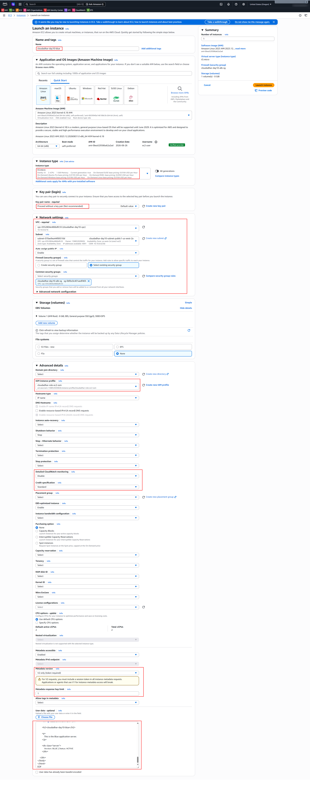

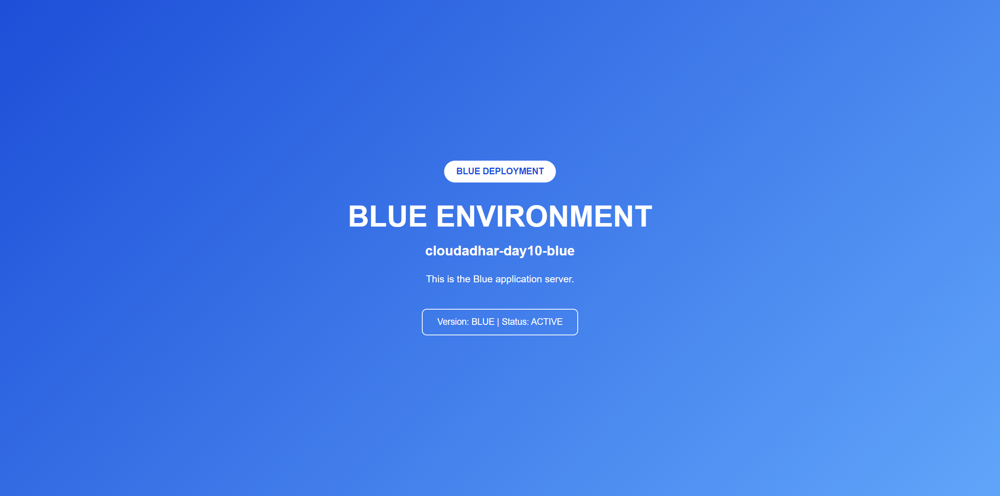

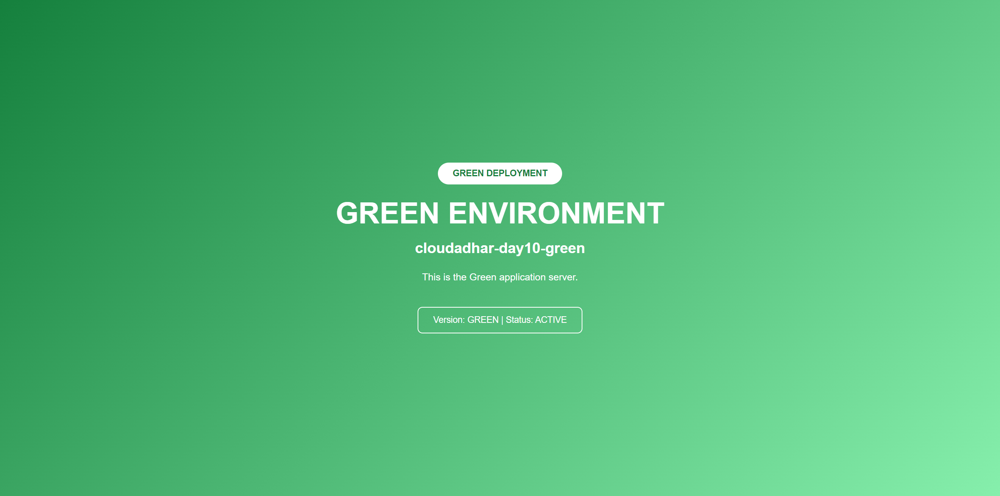

---

# Part 2 — ALB Target Groups

Two HTTP target groups were created:

```text
cloudadhar-day10-tg-blue
cloudadhar-day10-tg-green
```

Each target group contained its corresponding EC2 instance.

The target groups used HTTP traffic on port `80`.

### Blue Target Group

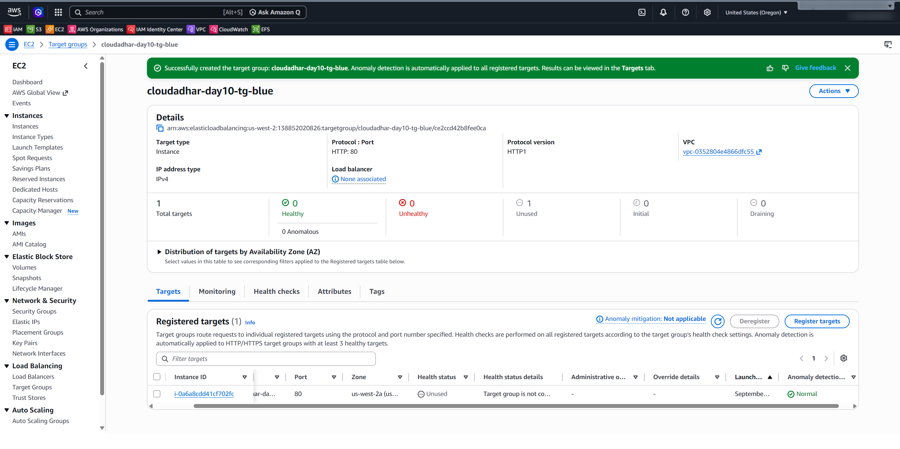

### Green Target Group

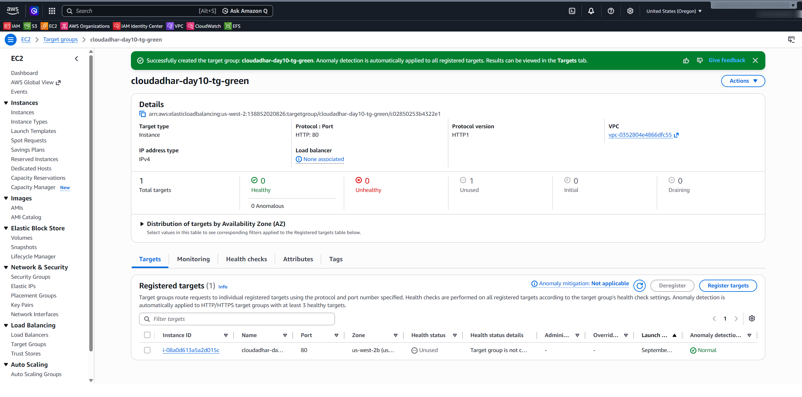

---

# Part 3 — Application Load Balancer

An internet-facing Application Load Balancer was created:

```text
cloudadhar-day10-alb
```

The ALB listens on:

```text
HTTP :80
```

The ALB distributes HTTP requests to the Blue and Green target groups.

### Evidence

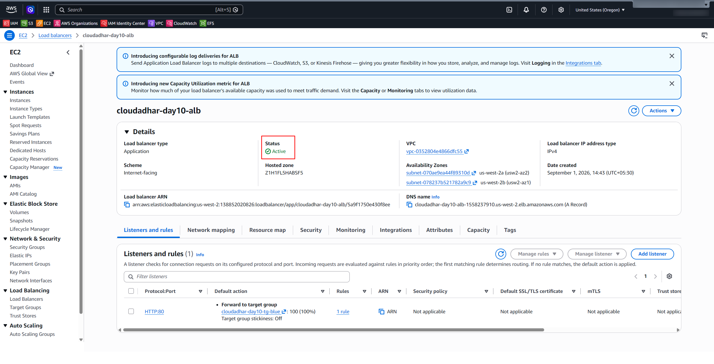

---

# Part 4 — ALB Path-Based Routing

The ALB was configured with path-based routing.

```text
/blue  → Blue Target Group

/green → Green Target Group
```

This demonstrates **Layer 7 routing**, because the ALB examines the HTTP request path.

### Example

```text
Client
   |
   | GET /blue
   v
  ALB
   |
   +----> Blue Target Group
              |
              v
          Blue EC2
```

And:

```text
Client
   |
   | GET /green
   v
  ALB
   |
   +----> Green Target Group
              |
              v
          Green EC2
```

### Evidence

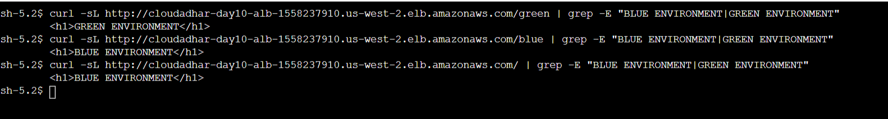

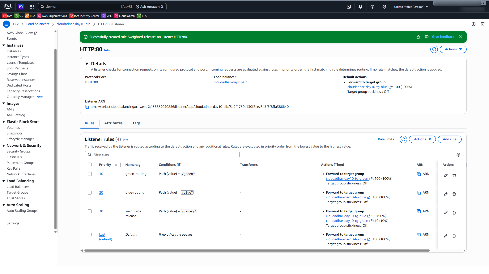

---

# Part 5 — Weighted Blue/Green Routing

A weighted routing rule was configured for the `/canary` path.

Traffic was distributed between the Blue and Green target groups.

The purpose of this test was to demonstrate a controlled Blue/Green release where traffic can be shifted between two application versions.

### Evidence

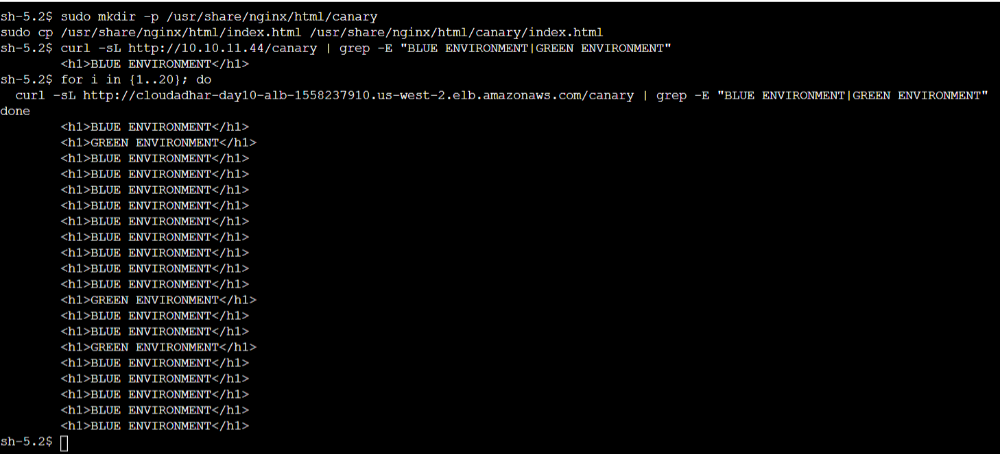

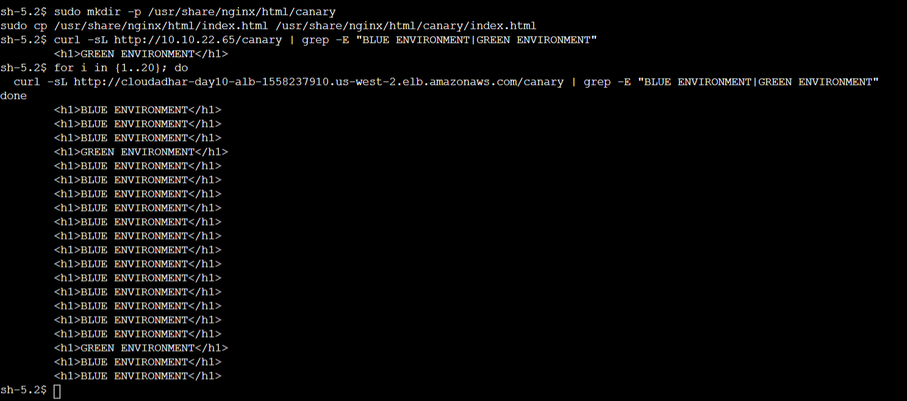

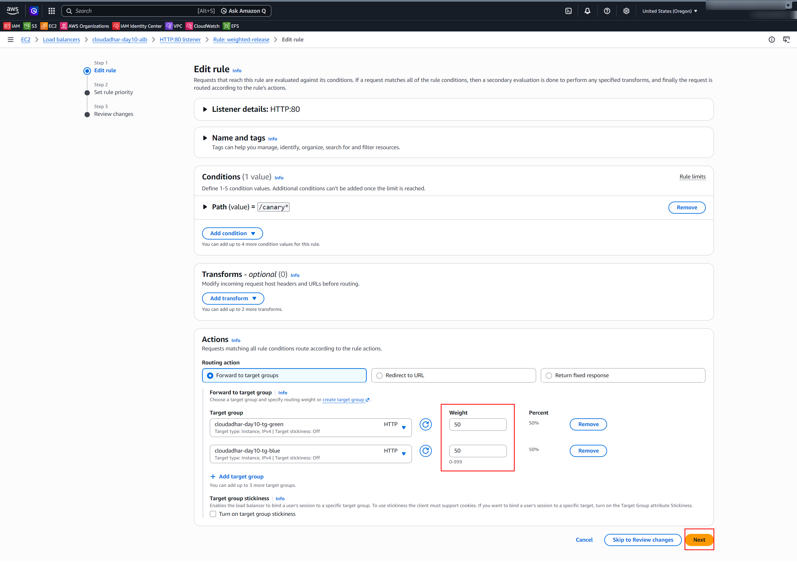

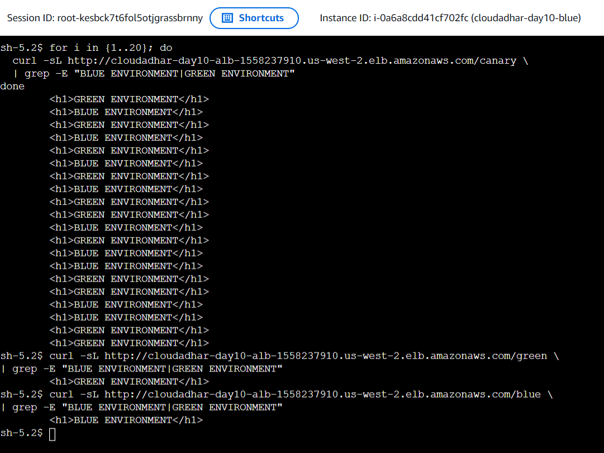

---

# Part 6 — Connection Draining / Deregistration

The Green target was deregistered from its target group to demonstrate the target lifecycle during removal.

The target entered the:

```text
Draining
```

state.

During draining, existing connections could continue while new traffic was prevented from being sent to the deregistering target.

After deregistration, requests specifically routed to the Green target group returned:

```text
503 Service Unavailable
```

The Green target was subsequently registered again and returned to the healthy state.

### Evidence

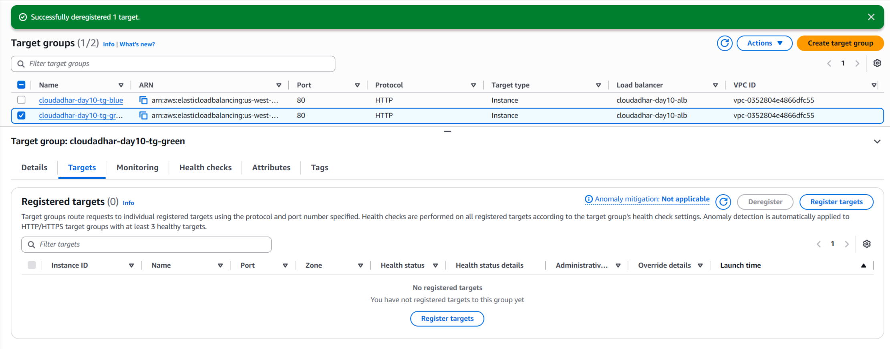

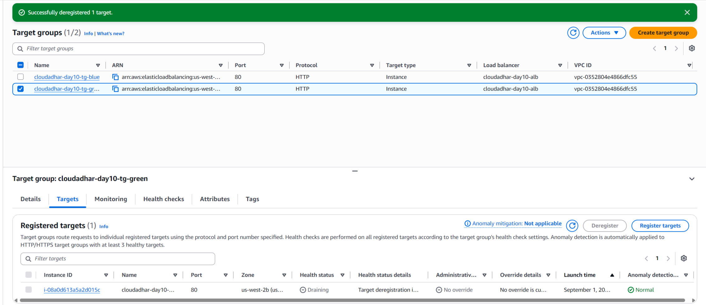

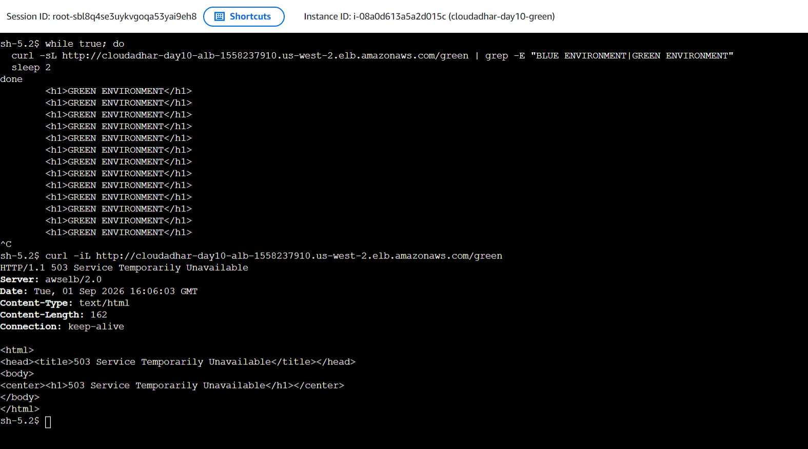

---

# Part 7 — Network Load Balancer

A Network Load Balancer was created:

```text
cloudadhar-day10-nlb
```

The NLB was configured as:

* Internet-facing
* IPv4
* Across two Availability Zones
* TCP listener on port `80`

---

# Part 8 — NLB Target Group

The existing ALB target groups could not be directly reused because they were configured for HTTP.

Therefore, a separate TCP target group was created:

```text
cloudadhar-day10-tg-nlb
```

Configuration:

| Property          | Value                  |
| ----------------- | ---------------------- |
| Target Type       | Instances              |
| Protocol          | TCP                    |
| Port              | 80                     |
| VPC               | `cloudadhar-day10-vpc` |
| Health Check      | HTTP                   |
| Health Check Path | `/`                    |
| Health Check Port | Traffic port           |

Both Blue and Green EC2 instances were registered with the target group.

### Evidence

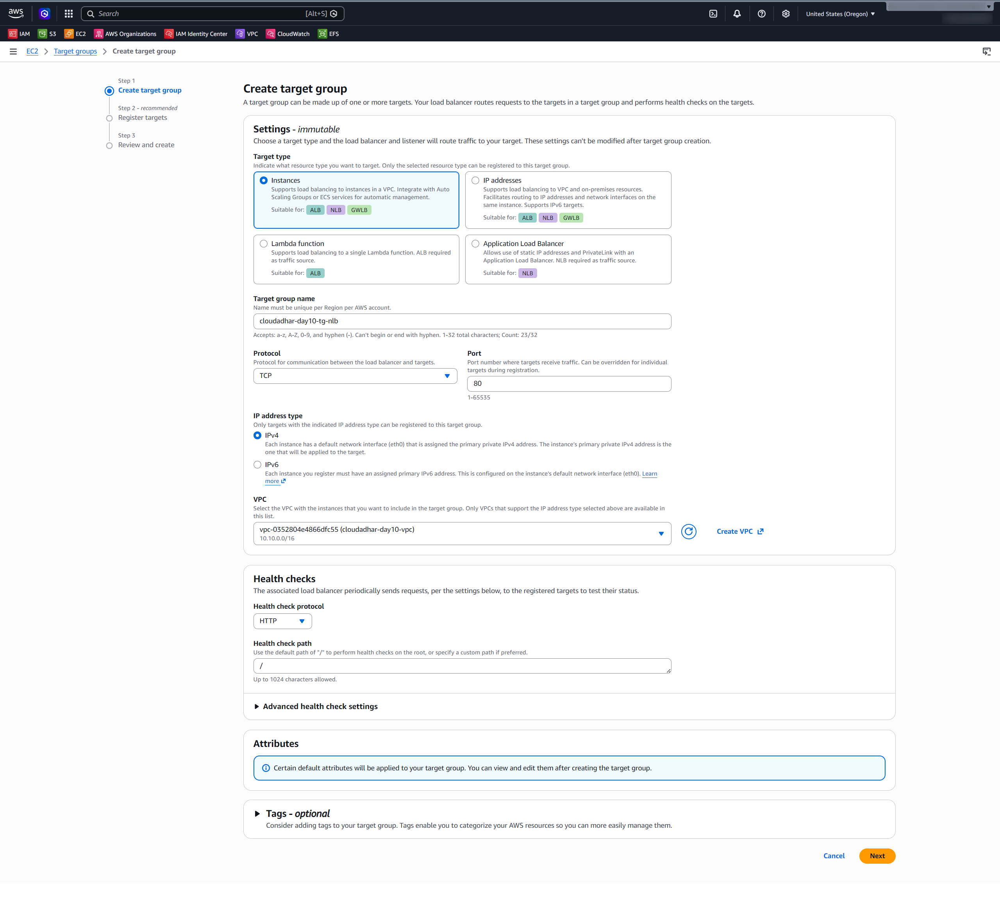

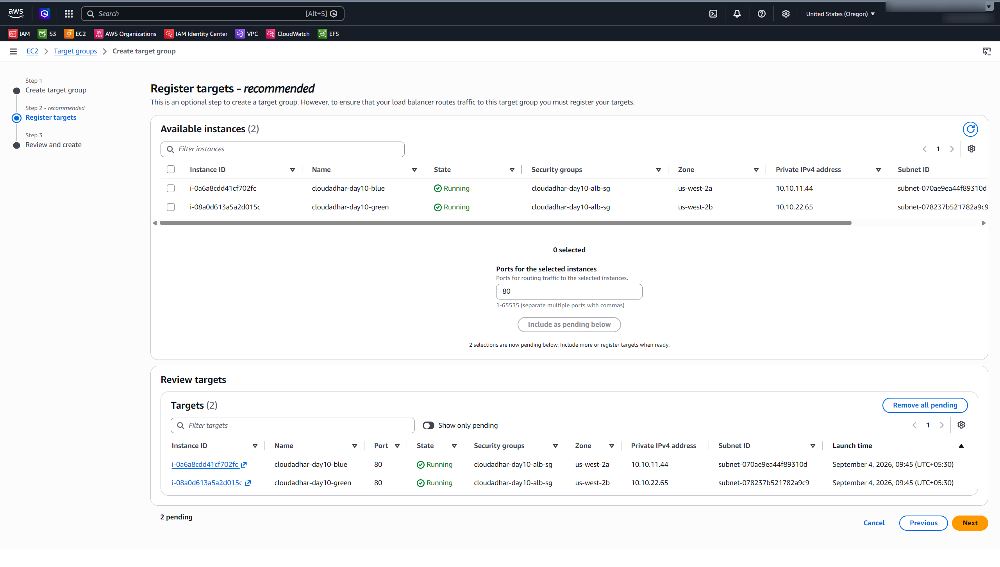

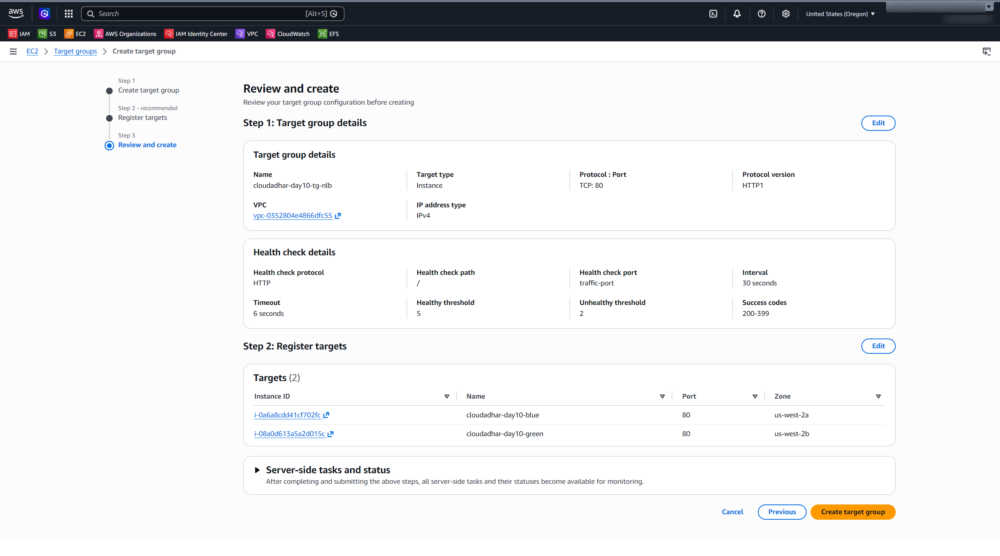

---

# Part 9 — NLB Target Health

The NLB target group successfully reported:

```text
Total Targets: 2
Healthy:       2
Unhealthy:     0
Draining:      0
```

Both EC2 instances were healthy:

```text
Blue  → Healthy
Green → Healthy
```

### Evidence

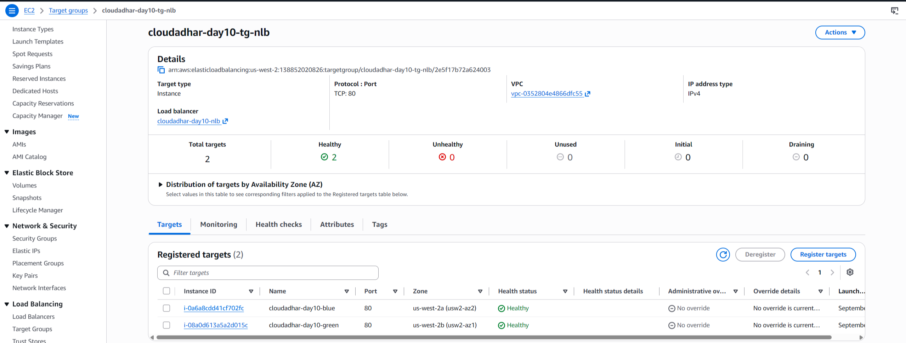

---

# Part 10 — NLB DNS Testing

The NLB provided a DNS endpoint similar to:

```text
cloudadhar-day10-nlb-xxxxxxxxxxxx.elb.us-west-2.amazonaws.com
```

The endpoint was tested using HTTP requests.

The NLB successfully forwarded requests to the backend NGINX servers.

Testing confirmed responses from both:

```text
BLUE ENVIRONMENT
```

and:

```text
GREEN ENVIRONMENT
```

### Important Difference from ALB

The NLB does **not** perform path-based routing.

For example:

```text
/blue
/green
/canary
```

are not routing rules for the NLB.

The NLB works at Layer 4:

```text
Client
   |
   v
NLB :80
   |
   +------> Blue EC2
   |
   +------> Green EC2
```

It distributes TCP connections among healthy targets.

### Evidence

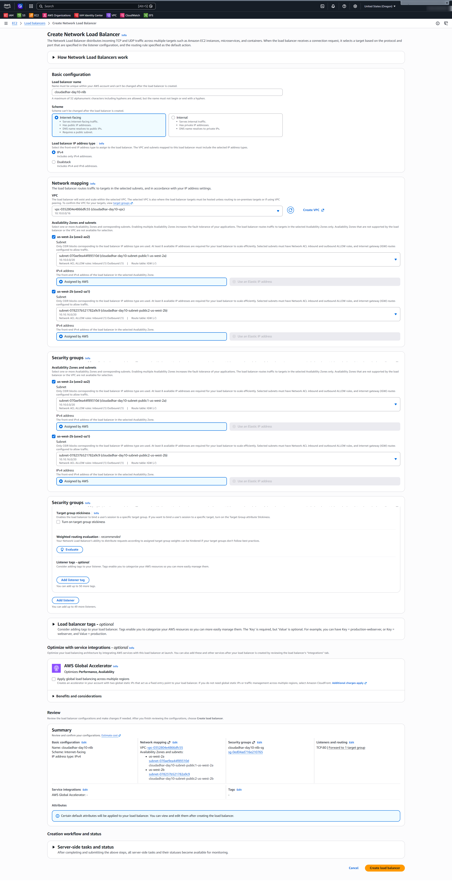

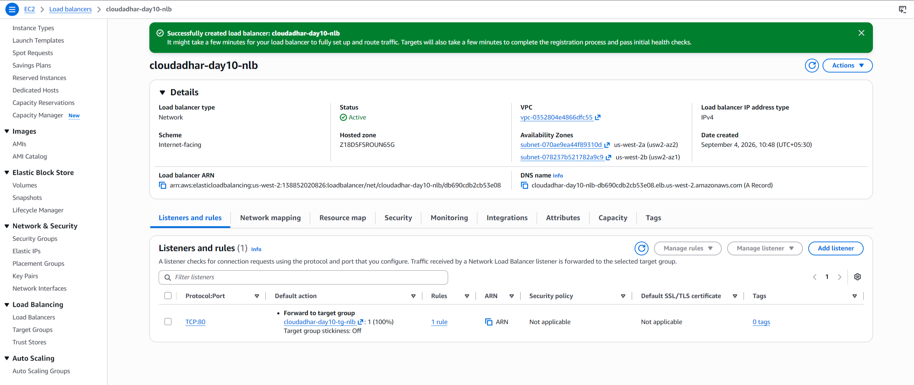

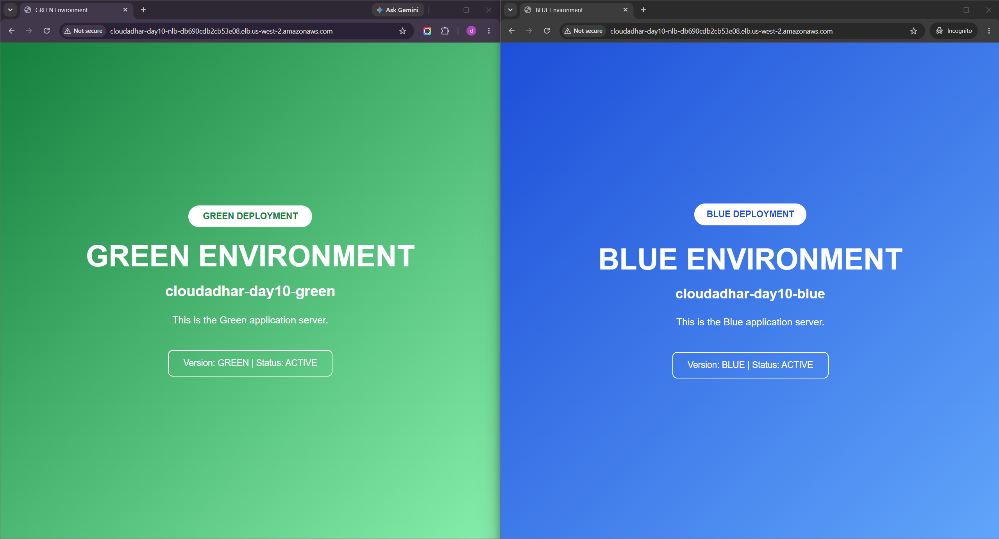

---

# ALB vs NLB

| Feature            | ALB                     | NLB                   |
| ------------------ | ----------------------- | --------------------- |
| OSI Layer          | Layer 7                 | Layer 4               |
| Understands HTTP   | Yes                     | No                    |
| Path-based routing | Yes                     | No                    |
| Host-based routing | Yes                     | No                    |
| TCP load balancing | No                      | Yes                   |
| URL-aware          | Yes                     | No                    |
| Health checks      | Yes                     | Yes                   |
| Main use           | HTTP/HTTPS applications | TCP/UDP/TLS workloads |

### Simple way to remember

```text
ALB = "I understand your HTTP request."

NLB = "I only care about the network connection."
```

---

# Key Learnings

## 1. Layer 7 Routing

ALB can inspect HTTP requests and route based on:

* URL path
* Host header
* HTTP-related conditions

Example:

```text
/blue  → Blue
/green → Green
```

---

## 2. Weighted Blue/Green Deployment

Weighted forwarding allows traffic to be gradually shifted between application versions.

Example:

```text
Blue  → 80%
Green → 20%
```

This can be used for controlled releases and canary deployments.

---

## 3. Health Checks

Load balancers continuously check target health.

If a target becomes unhealthy, the load balancer stops sending new traffic to it.

---

## 4. Connection Draining

Before completely removing a target, existing connections can be allowed to finish.

This helps prevent abruptly terminating active user requests.

---

## 5. NLB Layer 4 Load Balancing

The NLB does not inspect HTTP paths.

It distributes network connections to healthy targets.

---

# Final Result

Successfully completed the Day 10 ALB Blue/Green Routing and NLB lab.

The lab demonstrated:

* Two independent NGINX application environments
* ALB Layer 7 routing
* Path-based routing
* Weighted Blue/Green traffic distribution
* Canary-style traffic testing
* Target health monitoring
* Target deregistration
* Connection draining
* NLB Layer 4 TCP load balancing
* NLB health checks
* Reusing the same EC2 instances behind an NLB
* NLB DNS-based access
* Verification of traffic reaching both Blue and Green environments

---

# Cleanup

After completing the lab and capturing the required evidence, the Day 10 AWS resources were cleaned up.

The cleanup included:

* Deregistering EC2 targets from target groups
* Terminating the Blue EC2 instance
* Terminating the Green EC2 instance
* Deleting the Network Load Balancer
* Deleting the Application Load Balancer
* Deleting the NLB target group
* Deleting the Blue ALB target group
* Deleting the Green ALB target group
* Deleting the ALB security group
* Deleting the NLB security group
* Deleting the web security group
* Deleting the NAT Gateway
* Releasing the associated Elastic IP
* Detaching and deleting the Internet Gateway
* Deleting the route tables
* Deleting the subnets
* Deleting the Day 10 VPC

> Cleanup was performed to avoid unnecessary AWS charges after completing the hands-on lab.

---

# Where I Got Stuck

**No blocker.**

The main issue encountered during the NLB setup was that the existing ALB HTTP target groups were not available for the NLB listener.

This was expected because the ALB target groups used HTTP, while the NLB lab required a TCP target group.

A separate TCP target group was therefore created:

```text
cloudadhar-day10-tg-nlb
```

The Blue and Green EC2 instances were registered successfully and both became healthy.

---

# Conclusion

This lab provided practical experience with AWS Elastic Load Balancing and demonstrated why ALB and NLB are used for different workloads.

The key takeaway is:

```text
ALB
Layer 7
HTTP-aware
Path/host-based routing
Blue/Green application routing
        |
        v
     Web apps


NLB
Layer 4
Connection-aware
TCP load balancing
Very high-performance network traffic
        |
        v
    TCP services
```

The same Blue and Green EC2 instances were successfully used behind both load balancer types, demonstrating how AWS load balancing can be selected based on application and protocol requirements.
