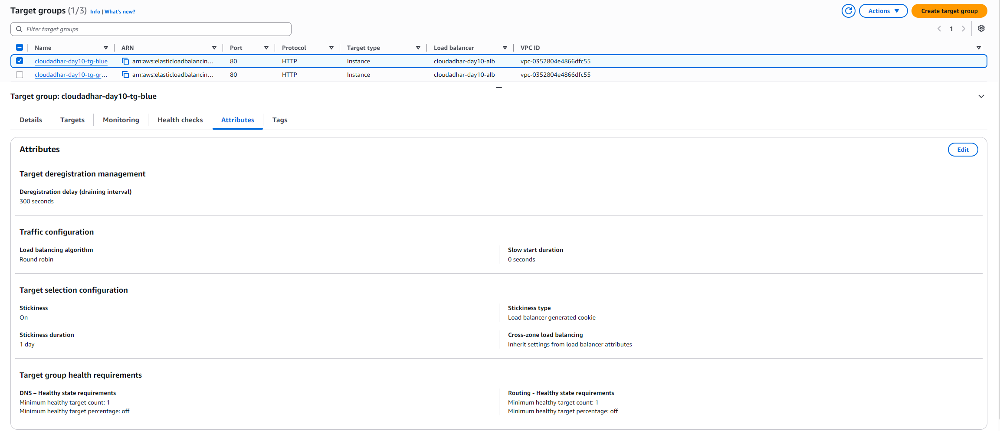
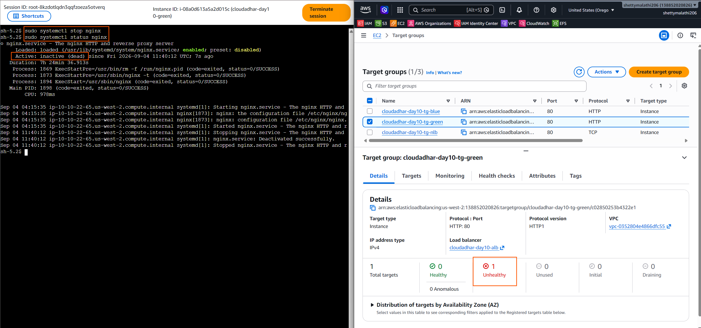
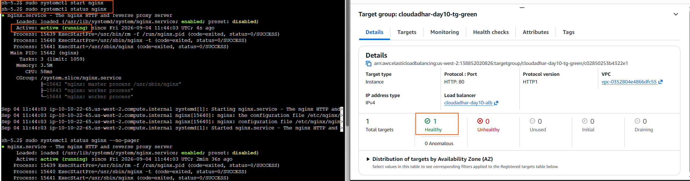
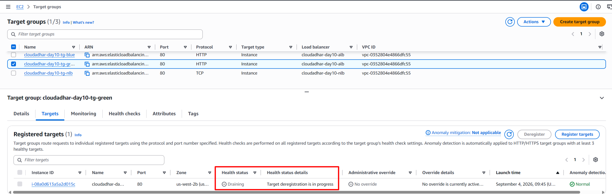

# Week 5 - Day 10: ALB Blue/Green Routing and NLB

## Name

Malathi Shetty

## Week 5 - Day 10

**Topic:** Application Load Balancer (ALB) Blue/Green Routing and Network Load Balancer (NLB)

**AWS Region:** `us-west-2` (Oregon)

---

## Tasks Completed

* [x] Watched/read the weekly content
* [x] Completed the hands-on lab
* [x] Created Blue and Green NGINX environments
* [x] Configured ALB path-based routing
* [x] Configured weighted Blue/Green routing
* [x] Tested traffic distribution
* [x] Enabled target group stickiness
* [x] Tested target health monitoring
* [x] Tested target deregistration and connection draining
* [x] Created a Network Load Balancer
* [x] Created a TCP target group for the NLB
* [x] Registered Blue and Green EC2 instances with the NLB
* [x] Verified NLB target health
* [x] Tested NLB DNS access
* [x] Captured screenshots/evidence
* [x] Cleaned up AWS resources

---

# Architecture


---

# Architecture Overview

This lab demonstrates the practical difference between an **Application Load Balancer (ALB)** and a **Network Load Balancer (NLB)**.

The **ALB operates at Layer 7** and understands HTTP/HTTPS requests. This allows it to make routing decisions based on application-level information such as URL paths and host headers.

The **NLB operates at Layer 4** and distributes network connections such as TCP traffic to healthy targets. It does not perform URL path-based routing such as `/blue`, `/green`, or `/canary`.

Two separate NGINX EC2 environments were created:

* **Blue environment** — represents the current application version
* **Green environment** — represents the new application version

The same EC2 instances were subsequently registered with a separate TCP target group and reused behind the NLB.

---

# AWS Resources

## VPC

| Resource | Value                  |
| -------- | ---------------------- |
| VPC Name | `cloudadhar-day10-vpc` |
| Region   | `us-west-2`            |
| CIDR     | `10.10.0.0/16`         |

### Subnets

| Availability Zone | Subnet Type | CIDR            |
| ----------------- | ----------- | --------------- |
| us-west-2a        | Public      | `10.10.0.0/20`  |
| us-west-2b        | Public      | `10.10.16.0/20` |

---

## EC2 Instances

### Blue

| Property          | Value                   |
| ----------------- | ----------------------- |
| Name              | `cloudadhar-day10-blue` |
| Instance ID       | `i-0a6a8cdd41cf702fc`   |
| Private IP        | `10.10.11.44`           |
| Availability Zone | `us-west-2a`            |
| Application       | NGINX                   |
| Port              | `80`                    |

### Green

| Property          | Value                    |
| ----------------- | ------------------------ |
| Name              | `cloudadhar-day10-green` |
| Instance ID       | `i-08a0d613a5a2d015c`    |
| Private IP        | `10.10.22.65`            |
| Availability Zone | `us-west-2b`             |
| Application       | NGINX                    |
| Port              | `80`                     |

---

# Security Groups

## ALB Security Group

`cloudadhar-day10-alb-sg`

Used by the Application Load Balancer to allow HTTP traffic for the lab.

## NLB Security Group

`cloudadhar-day10-nlb-sg`

Used by the Network Load Balancer for TCP traffic on port `80`.

## EC2 Security Group

The Blue and Green EC2 instances used the web/ALB security configuration required for the lab.

---

# Part 1 — Blue and Green NGINX Servers

Two EC2 instances were launched in different Availability Zones.

Each instance hosted a different NGINX response so that the backend serving a request could be identified easily.

### Blue Response

```text
BLUE DEPLOYMENT
BLUE ENVIRONMENT
cloudadhar-day10-blue
Version: BLUE | Status: ACTIVE
```

### Green Response

```text
GREEN DEPLOYMENT
GREEN ENVIRONMENT
cloudadhar-day10-green
Version: GREEN | Status: ACTIVE
```

This made it possible to visually verify which backend received each request.

### Evidence


---

# Part 2 — ALB Target Groups

Two HTTP target groups were created:

```text
cloudadhar-day10-tg-blue
cloudadhar-day10-tg-green
```

Each target group contained its corresponding EC2 instance.

Both target groups used:

```text
Protocol: HTTP
Port: 80
Health Check Path: /
```

### Blue Target Group


### Green Target Group


---

# Part 3 — Application Load Balancer

An internet-facing Application Load Balancer was created:

```text
cloudadhar-day10-alb
```

The ALB listens on:

```text
HTTP :80
```

The ALB distributes HTTP requests to the Blue and Green target groups.

### Evidence


---

# Part 4 — ALB Path-Based Routing

The ALB was configured with path-based routing.

```text
/blue  → Blue Target Group
/green → Green Target Group
```

This demonstrates **Layer 7 routing**, because the ALB examines the HTTP request path before selecting the target group.

### Example: Blue Routing

```text
Client
   |
   | GET /blue
   v
  ALB
   |
   +----> Blue Target Group
              |
              v
          Blue EC2
```

### Example: Green Routing

```text
Client
   |
   | GET /green
   v
  ALB
   |
   +----> Green Target Group
              |
              v
          Green EC2
```

### Evidence


---

# Part 5 — Weighted Blue/Green Routing

A weighted forwarding rule was configured for the `/canary` path.

The rule distributed traffic between the Blue and Green target groups.

The lab used:

```text
Blue  → 50%
Green → 50%
```

The purpose was to demonstrate controlled traffic distribution between two application versions.

Weighted routing provides a foundation for **canary and progressive deployment strategies**, where traffic can be gradually shifted from one version to another.

### Evidence


---

# Part 6 — Target Health, Stickiness, and Connection Draining

## Target Group Stickiness

Target group stickiness was enabled for the relevant ALB routing rules and the Blue target group.

The target group used:

```text
Stickiness Type: Load balancer generated cookie
Stickiness Duration: 1 day
```

Stickiness allows a client to remain associated with the same target for the configured duration.

It is useful when an application requires session affinity.

### Evidence



---

## Green Target Health Test

The Green target was intentionally made unhealthy to demonstrate ALB health monitoring.

NGINX was stopped on the Green EC2 instance:

```bash
sudo systemctl stop nginx
```

The Green target then failed the ALB health check and became **Unhealthy**.

```text
Green EC2
    |
    | NGINX stopped
    v
ALB health check /
    |
    v
Target → Unhealthy
```

### Evidence



NGINX was then started again:

```bash
sudo systemctl start nginx
```

After successful health checks, the Green target recovered to the **Healthy** state.

### Evidence



This demonstrated that the ALB continuously monitors registered targets and uses health-check results when determining which targets can receive traffic.

---

## Connection Draining / Deregistration

The Green target was deregistered from its target group to demonstrate the target lifecycle during removal.

The target entered the:

```text
Draining
```

state.

During the draining period, existing connections can be allowed to complete while the target is being removed from normal traffic distribution.

After deregistration, requests specifically routed to the Green target group returned:

```text
503 Service Unavailable
```

The Green EC2 instance was subsequently registered again and returned to the healthy state.

### Evidence




---

# Part 7 — Network Load Balancer

A Network Load Balancer was created:

```text
cloudadhar-day10-nlb
```

The NLB was configured as:

* Internet-facing
* IPv4
* Across two Availability Zones
* TCP listener on port `80`

The NLB provides Layer 4 load balancing and forwards TCP connections to healthy targets.

---

# Part 8 — NLB Target Group

The existing ALB target groups could not be directly reused for the NLB listener because they were configured for HTTP.

A separate TCP target group was therefore created:

```text
cloudadhar-day10-tg-nlb
```

### Configuration

| Property              | Value                  |
| --------------------- | ---------------------- |
| Target Type           | Instances              |
| Protocol              | TCP                    |
| Port                  | `80`                   |
| VPC                   | `cloudadhar-day10-vpc` |
| Health Check Protocol | HTTP                   |
| Health Check Path     | `/`                    |
| Health Check Port     | Traffic port           |

Both Blue and Green EC2 instances were registered with the NLB target group.

### Evidence


---

# Part 9 — NLB Target Health

The NLB target group successfully reported:

```text
Total Targets: 2
Healthy:       2
Unhealthy:     0
Draining:      0
```

Both EC2 instances were healthy:

```text
Blue  → Healthy
Green → Healthy
```

### Evidence


---

# Part 10 — NLB DNS Testing

The NLB provided a DNS endpoint similar to:

```text
cloudadhar-day10-nlb-xxxxxxxxxxxx.elb.us-west-2.amazonaws.com
```

The endpoint was tested using HTTP requests.

The NLB successfully forwarded requests to the backend NGINX servers.

Testing confirmed responses from both:

```text
BLUE ENVIRONMENT
```

and:

```text
GREEN ENVIRONMENT
```

### Important Difference from ALB

The NLB does **not** perform URL path-based routing.

Paths such as:

```text
/blue
/green
/canary
```

are not NLB routing rules.

Instead, the NLB operates at Layer 4 and distributes TCP connections among healthy targets.

```text
Client
   |
   v
NLB :80
   |
   +------> Blue EC2
   |
   +------> Green EC2
```

### Evidence


---

# ALB vs NLB

| Feature            | ALB                      | NLB                                 |
| ------------------ | ------------------------ | ----------------------------------- |
| OSI Layer          | Layer 7                  | Layer 4                             |
| Understands HTTP   | Yes                      | No                                  |
| Path-based routing | Yes                      | No                                  |
| Host-based routing | Yes                      | No                                  |
| TCP load balancing | Not its primary function | Yes                                 |
| URL-aware          | Yes                      | No                                  |
| Health checks      | Yes                      | Yes                                 |
| Main use           | HTTP/HTTPS applications  | TCP/TLS and other Layer 4 workloads |

### Simple Way to Remember

```text
ALB = "I understand your HTTP request."

NLB = "I care about the network connection."
```

---

# Key Learnings

## 1. Layer 7 Routing

An ALB can inspect HTTP requests and route traffic based on conditions such as:

* URL path
* Host header
* HTTP-related conditions

Example:

```text
/blue  → Blue
/green → Green
```

---

## 2. Weighted Blue/Green Deployment

Weighted forwarding allows traffic to be distributed between application versions.

Example:

```text
Blue  → 50%
Green → 50%
```

In this lab, the `/canary` rule was configured with 50% traffic to Blue and 50% traffic to Green.

This demonstrates the basic concept behind controlled and progressive application releases.

---

## 3. Health Checks

Load balancers continuously perform health checks against registered targets.

If a target becomes unhealthy, it is removed from normal traffic distribution while healthy targets continue serving requests.

The Green NGINX instance was intentionally stopped during the lab to demonstrate this behavior.

---

## 4. Target Group Stickiness

Stickiness can keep a client associated with the same backend target for a configured duration.

This can be useful for applications that require session persistence.

In this lab, stickiness was enabled using a load balancer-generated cookie.

---

## 5. Connection Draining

When a target is deregistered, the load balancer can allow existing connections to complete during the configured deregistration delay.

This helps reduce disruption when targets are removed during deployment, scaling, or maintenance.

---

## 6. NLB Layer 4 Load Balancing

The NLB does not inspect HTTP URL paths.

Instead, it distributes network connections to healthy targets.

The lab used a TCP listener and TCP target group to demonstrate this Layer 4 behavior.

---

# Final Result

Successfully completed the **Day 10 ALB Blue/Green Routing and NLB lab**.

The lab demonstrated:

* Two independent NGINX application environments
* ALB Layer 7 routing
* Path-based routing
* Weighted Blue/Green traffic distribution
* Canary-style traffic testing
* Target health monitoring
* Target group stickiness
* Target deregistration
* Connection draining
* NLB Layer 4 TCP load balancing
* NLB health checks
* Reusing the same EC2 instances behind an NLB
* NLB DNS-based access
* Verification of traffic reaching both Blue and Green environments

---

# Cleanup

After completing the lab and capturing the required evidence, the Day 10 AWS resources were cleaned up.

The cleanup included:

* Deregistering EC2 targets from target groups
* Terminating the Blue EC2 instance
* Terminating the Green EC2 instance
* Deleting the Network Load Balancer
* Deleting the Application Load Balancer
* Deleting the NLB target group
* Deleting the Blue ALB target group
* Deleting the Green ALB target group
* Deleting the ALB security group
* Deleting the NLB security group
* Deleting the web security group
* Detaching and deleting the Internet Gateway
* Deleting the route tables
* Deleting the subnets
* Deleting the Day 10 VPC

> Cleanup was performed after capturing the required evidence to avoid unnecessary AWS charges.

---

# Where I Got Stuck

**No blocker.**

The main issue encountered during the NLB setup was that the existing ALB HTTP target groups were not available for the NLB listener.

This was expected because the ALB target groups were configured for HTTP, while the NLB lab required a TCP target group.

A separate TCP target group was therefore created:

```text
cloudadhar-day10-tg-nlb
```

The Blue and Green EC2 instances were successfully registered with the NLB target group, and both targets became healthy.

---

# Conclusion

This lab provided practical experience with AWS Elastic Load Balancing and demonstrated why ALB and NLB are designed for different traffic patterns.

The key distinction can be summarized as:

```text
ALB
Layer 7
HTTP-aware
Path/host-based routing
Blue/Green application routing
        |
        v
    Web Applications
```

and:

```text
NLB
Layer 4
Connection-oriented
TCP/TLS load balancing
Low-latency network traffic
        |
        v
    TCP Services
```

The same Blue and Green EC2 instances were successfully used behind both load balancer types.

This demonstrated that the appropriate load balancer should be selected based on the **application protocol, routing requirements, and workload characteristics**.

The overall production lesson from Day 10 is:

```text
Health Checks
     +
Load Balancing
     +
Controlled Traffic Shifting
     +
Connection Draining
     +
Multiple Availability Zones
     =
More Resilient Applications
```

Week 5 therefore provided practical experience with both **application-level traffic management** and **network-level load balancing** using AWS.
